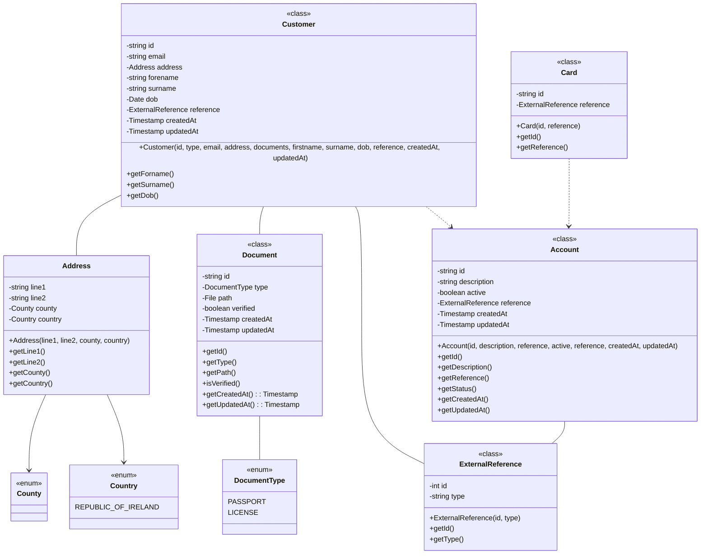
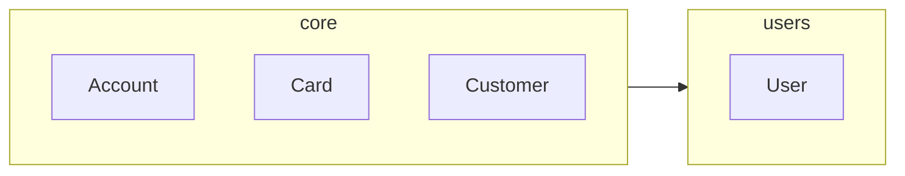
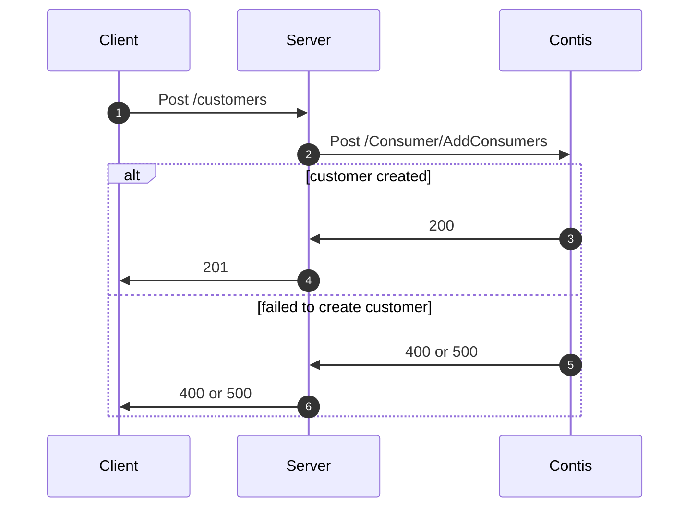
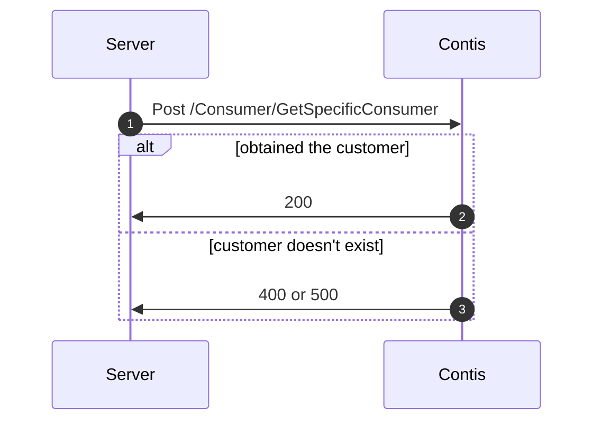
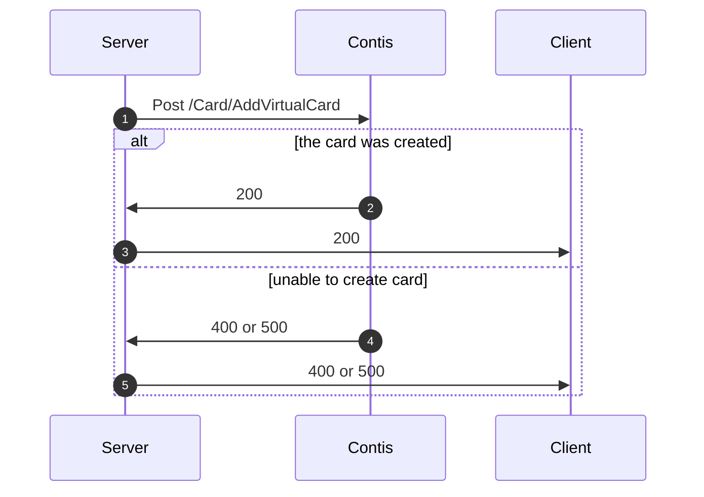
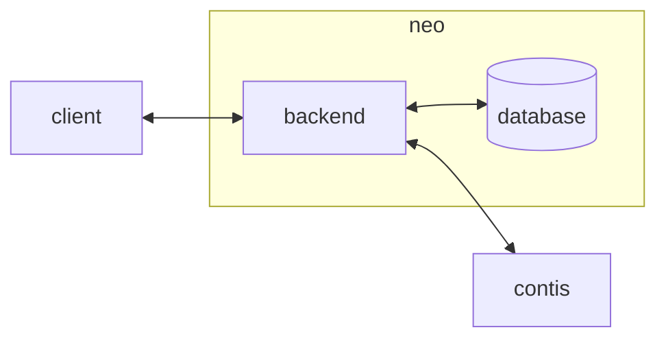

# The Neo Project

## Requirements

Below is the minimum set of requirements for a digital bank, taken from Germain Bahri's article, [How to build a digital bank from scratch ... & the economics!](https://www.linkedin.com/pulse/how-build-digital-bank-from-scratch-economics-germain-bahri) :-

1. The capabilities to onboard a person(s)
2. An account associated with a person
3. A card tied to an individuals account
4. A payment feature
5. A list of payment transactions for an account

We won't bog ourselves down in the economics section of the article, rather, we will be focusing on implementing a solution.

## Discovery

For many digital first banks, such as Revolut and Monzo, the onboarding process consists of a set of steps to collect basic information on an individual. This is a vital requirement under guidelines known as ["Know Your Customer"](https://en.wikipedia.org/wiki/Know_your_customer), which fit within the broader scope of a bank's anti-money laundering policy. Since this is a small scale project, we will not be including any anti-money laundering capabilities, instead focusing on the basic capabilities set out in the "Requirements" section above. Continuing with our onboarding process, the basic information we will gather on an individual during sign up will be, but not limited to :-

1. First name
2. Surname
3. Date of birth
4. Address
5. Email
6. Phone number

Under the same "Know Your Customer" guidelines, the individual must provide :-

1. Proof of identify, a passport or driving license
2. Proof of address, a dated bill with name and address

The proof of identity can be verified by a third party service, one such service could be [Onfido](https://onfido.com/). It is used by the likes of Revolut, Remitly and Orange. However, given the scale of our project, we will incorporate a "dummy" service into the overall design such that it could be used for testing, but can be changed out in a production environment.

Once the information has been collected, and the individual verified, this person will require an account. [According to Citizens Information there a number of different accounts](https://www.citizensinformation.ie/en/money_and_tax/personal_finance/banking/opening_and_switching_a_bank_account.html#l2b406), such as :-

* Current account
* Student current account
* Basic bank account
* Deposit account

Of these accounts, the [current account](https://www.co-operativebank.co.uk/tools-and-guides/current-accounts/what-is-a-current-account/) is the most primitive of these accounts, it generally offers a means for people to deposit or withdraw money through the use of a credit card, cheque or other means.

Within the context of our project, a person's account, their cards and payments must be backed by a third party service. Using these services will provide gaurentees for our customers, but also ensuring the platform would be compliant with all required regulations and guidelines. a lot of these third party services do not allow us to simple sign up and use a sand box environment like Stripe does, therefore, like the proof of identify flow, we will have to design the implementation in such a way we can use a "dummy" implementation of the third-party service, later swapping it out for the "real thing" implementation. Should we consider moving forward with an "real thing" implementation, [Contis](https://developer.contis.com/quickstartguide/) appears to be the most open and transparent documentation available, even providing getting started guides on how to integrate their features into our platform, so these should be a good shout.

We will focus on virtual cards to begin with, and with the likes of Google Pay and Apple Pay becoming more and more relevent today, integrating these virtual cards into our platform will cover the requirement of at least one payment feature.

## Scope

* We will be focusing solely on the implementation of a solution for requirements set out in the "Requirements" section above.
* There will be no anti-fraud or anti-money laundering capabilities, of any kind, incorporated into this project.
* The backend interfaces will be Restful APIs, which will encourage a mobile first frontend in the future, but for now, the focus will be the backend.
* Only virtual cards will be considered as part of the implementation, but we will allow for expansion into physical cards should it be required.

## Implementation

### Class View

In this section we document the essential models that will store the required information of our various components.



### Package View

This will be a monolithic architecture purely because there will be only a single developer, but also most MVPs are implemented as a monolithic applications, as opposed to a microservice architecture. With that being said, as the project scales, we will make concious decisions to allow an easy transition to a microservice architecture should it be required.



### Process View

As already mentioned, we will be using the [Contis](https://www.contis.com) as our proposed banking-as-a-service platform. They give a basic ["Getting Started"](https://developer.contis.com/quickstartguide/) guide, as well as a number of [flow diagrams](https://developer.contis.com/consumerworkflow/), on how to create a `Consumer`, or `Customer`, tie a card to said `Consumer`, etc. We will document this here through the use of a sequence diagram.

#### **Creating a customer**

This diagram illustrates how our backend would integrate with Contis' API to add a customer, or cusomer in their terms, to their platform.



According to the `AddConsumers` documentation, the KYC process is automatically initiated after the endpoint returns a successful response, this is extremely convinient and avoids us having to initiate the process ourselves.

#### **Retrieve a customer**

Our `Customer` maps to Contis' `Consumer`, below is a diagram documenting how our backend would obtain a specific `Consumer`. We've explicitly exluded the a client participant from this diagram `Consumer` will be converted to a `Customer` internally.



#### **Add a card to customer**

Within Contis, once a `Consumer` has been created, an `Account` is automatically created, therefore, once the `Consumer`, or `Customer`, has been created, we simply just have to add a card to the `Account`.



### Interface View

We will be focusing on the backend architecture for our minimum viable product, however, we would like to ensure there is room to create a client, such as an app. As such, the backend will implement Restful API's to allow interaction with our third party service.

#### **Create a customer**

This will create a customer in the third party service, and then store a reference to said customer in our application.

```text
POST /customers
```

#### **Get a customer**

This will return a customer from our database, populating it with additional information from the third party service.

```text
GET /customers/{id}
```

#### **Deactivate a customer**

To deactivate a customer, one should use this endpoint. We've choosen to deactivate, instead of deleting, as this is common practise in most industries.

```text
DELETE /customers/{id}
```

#### **Get an account**

To obtain an account, the customer first must be logged in, after which they are free to only access the accounts they own.

```text
GET /accounts/{id}
```

#### **Create a card**

The customer must first log in to access this endpoint. Upon creating an account, a card will automatically be added, however, in the event the card is compromised, this endpoint can be used to create a new card for the associated account.

```text
POST /accounts/{id}/cards
```

#### **Get a card**

The customer must first log in to access this endpoint. Once the customer has logged in, they are free to obtain metadata related to a specific card for a specific account through the use of this endpoint.

```text
GET /accounts/{id}/cards/{id}
```

#### **Deactivate a card**

The customer must first log in to access this endpoint. After the customer has verified their identity, they can deactivate a specific card for a specific account through this endpoint.

```text
DELETE /accounts/{id}/cards/{id}
```

### System View

The diagram below gives a very basic topology of how all components will interact. We will not use a microservice architecture, it will be a monolith with everything housed in a single application on the backend. Clients will call the backend, and it will carry out the necessary tasks and operations, i.e. talking to the database and/or Contis.



## Appendix

### Useful links

* <https://www.linkedin.com/pulse/how-build-digital-bank-from-scratch-economics-germain-bahri>
* <https://sandbox.contis.com/api-introduction/>
* <https://stripe.com/en-ie/guides/atlas/ama-tom-blomfield>
* <https://clearbank.github.io/docs/introduction>
* <https://developer.unnax.com/>
* <https://docs.solarisgroup.com/>
* <https://www.insiderintelligence.com/insights/banking-as-a-service-platform-providers/>
* <https://truelayer.com/en-ie/>
* <https://stripe.com/docs/treasury/examples/financial-accounts#platform-onboarding>
* <https://www.soprabanking.com/core-banking-system/>
